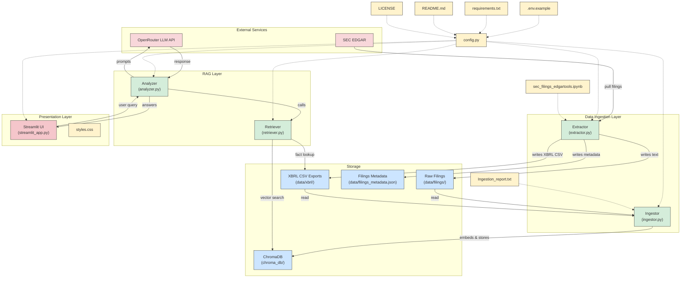

<p align="center">
  
</p>

<h1 align="center">SEC Financial Chatbot</h1>

A Retrieval-Augmented Generation (RAG) chatbot that answers questions about SEC 10-K filings for major tech companies. The system processes and stores SEC filings (10-K, text and XBRL) and provides intelligent, well-reasoned responses using OpenRouter's NVIDIA Llama 3.3 Nemotron Super 49B model.

---

## 🖼️ UI Preview

<table>
  <tr>
    <td align="center">
      <br/>
      <strong>ChatBot UI</strong>
    </td>
    <td align="center">
      <br/>
      <strong>ChatRoom</strong>
    </td>    
  </tr>
</table>

---

## 🚀 Key Features

- **Hybrid Retrieval**: Combines structured XBRL fact lookup (for numbers) with similarity search on narrative text
- **Follow-up Chat**: Understands pronouns and temporal references for conversational, multi-turn queries
- **Multi-Year & Section Support**: Ask about multiple years or specific 10-K sections in a single query
- **Markdown Answers**: LLM responses use Markdown for clarity (bold, lists, tables)
- **Source Attribution**: Cites specific filings, years, and companies in answers
- **Highly Customizable**: Easily add new companies, years, or filing types via configuration

> **Note:** This system can be used to download and analyze other SEC filings for any desired years, not just the default set. Simply update the configuration and data collection scripts as needed.
>
> The included Jupyter notebook (`sec_filings_edgartools.ipynb`) can be used to learn about the structure of SEC filings and to understand how to use EDGAR tools for data exploration.

---

## 🚀 Quick Start

1. **(Optional) Data Collection**  
   If you need to download filings, run:
   ```bash
   python extractor.py
   ```

2. **Ingest Data to Vector DB**  
   ```bash
   python ingestor.py
   ```
   > **Note:** The ChromaDB vector database will be loaded and populated after running the `ingestor.py` file.

3. **Launch the Web App**  
   ```bash
   streamlit run streamlit_app.py
   ```
   Open your browser to `http://localhost:8501`

---

## 🖥️ Usage

- **Ask Questions**: Type your question about 10-K filings (e.g., "What was Apple's revenue in 2024?")
- **Follow-up**: Use pronouns or references (e.g., "What about its profit margin that year?")
- **Quick Starters**: Click a quick starter button for example queries
- **Debug Mode**: Enable in the sidebar to see context and retrieval details
- **Multi-Year/Section**: Ask about multiple years or specific sections (e.g., "risk factors from 2022 to 2024")
- **Markdown Answers**: Answers are formatted for readability (bold, lists, tables)

---

## 📁 Project Structure

```
SEC-chatbot/
├── data/                  # Raw and processed SEC filings (text, XBRL, metadata)
│   ├── filings/           # Text 10-K filings (structured sections)
│   ├── xbrl/              # XBRL XML/XSD files
│   └── filings_metadata.json
├── chroma_db/             # Vector database (ChromaDB persistent storage)
├── config.py              # Centralized configuration (companies, years, models, etc.)
├── extractor.py           # Script to download SEC filings
├── ingestor.py            # Script to ingest filings into the vector DB
├── analyzer.py            # Core RAG chatbot logic (retrieval, context, LLM)
├── streamlit_app.py       # Streamlit web interface
├── sec_filings_edgartools.ipynb # Jupyter notebook for exploring SEC filings/EDGAR tools
├── requirements.txt       # Python dependencies
└── README.md
```

---

## 🗂️ About `chroma_db/`

The `chroma_db/` folder contains the persistent vector database used by the chatbot. It stores:
- **Vector embeddings** of all SEC filing text and XBRL chunks
- **Indexes** for fast similarity search and retrieval
- **Metadata** for each chunk (company, year, section, etc.)
- **Database state** so ChromaDB can resume or update without re-ingestion

Actual files to expect:
- `chroma.sqlite3` — The main SQLite database file for ChromaDB.
- Folders with UUID-like names (e.g., `838676d0-d288-4b32-aa0b-bc54d90e9fce/`) — Contain binary data, index files, and metadata for the vector store.
- Binary files (e.g., `data_level0.bin`, `header.bin`) — Store the actual vector data and index structures.
- `index_metadata.pickle` — Stores metadata about the vector index.

This folder is required for the chatbot to function. If deleted, you must re-run the ingestion process to rebuild the vector database.

---
## 🔗 Workflow



---

## 🎯 Example Questions

- "What was Apple's revenue in 2024?"
- "Compare Microsoft and Apple net income for 2020."
- "What are the main risk factors for Amazon in 2023?"
- "How did Nvidia capitalize on the AI boom from 2022 to 2024?"
- "What about their profit margin that year?"

---

## 🔧 Configuration

Edit `config.py` to customize:

### **Core Settings**
- **Companies**: `TOP_COMPANIES` - List of companies to analyze
- **Year Range**: `START_YEAR`, `END_YEAR` - Filing years to collect
- **API Keys**: `OPENROUTER_API_KEY`, `EDGAR_IDENTITY`

### **Vector Database**
- **Storage**: `CHROMA_PERSIST_DIRECTORY` - ChromaDB storage path
- **Collection**: `COLLECTION_NAME` - Vector collection name
- **Embedding Model**: `EMBEDDING_MODEL` - Sentence transformer model

### **RAG Configuration**
- **Chunking**: `MAX_CHUNK_SIZE`, `CHUNK_OVERLAP` - Text chunking parameters
- **Retrieval**: `DEFAULT_NUM_TEXT_CHUNKS` - Number of chunks to retrieve
- **LLM Model**: `DEFAULT_MODEL` - OpenRouter model selection

> **Model Options:**
> - `deepseek/deepseek-r1-0528:free` (May 28th update)
>   - Performance on par with OpenAI o1, but fully open-source and with open reasoning tokens.
>   - 671B parameters (37B active per inference pass).
>   - Highly recommended for open, transparent, and high-performance SEC analysis.

---

## 🧠 Technical Details

### **Data Processing Pipeline**
1. **Extraction**: Downloads 10-K filings and XBRL data from SEC EDGAR
2. **Structured Parsing**: Detects and extracts business sections, risk factors, MD&A, financial statements
3. **Intelligent Chunking**: Preserves sentence boundaries and section context
4. **Vector Storage**: Stores chunks with rich metadata for precise retrieval

### **Retrieval Strategy**
- **Hybrid Approach**: Combines semantic search with structured fact retrieval
- **Context-Aware**: Retrieves relevant text chunks based on query semantics
- **Metadata Filtering**: Supports company, year, and section-specific queries

### **Analysis Engine**
- **RAG Pipeline**: Retrieves relevant context and generates informed responses
- **Source Attribution**: Cites specific filings, companies, and years
- **Markdown Output**: LLM is prompted to use Markdown for clarity
- **Debug Mode**: Toggle to view context and retrieval details
- **Follow-up Support**: Handles pronouns and temporal references in chat
- **Highly Customizable**: Easily adapt to new companies, years, or filing types

### **Technologies**
- **Embedding Model**: `all-MiniLM-L6-v2` (SentenceTransformers)
- **Vector DB**: ChromaDB (cosine similarity, persistent storage)
- **LLM**: OpenRouter, `nvidia/llama-3.3-nemotron-super-49b-v1:free` (128K context window), `deepseek/deepseek-r1-0528:free` (fully open-source, 671B params, 37B active)
- **Web Framework**: Streamlit for responsive UI

---

## 🐛 Troubleshooting

- **No Data Found**: Run `python extractor.py` and `python ingestor.py`
- **Vector Database Empty**: Check that `chroma_db/` exists and is populated
- **API Key Issues**: Ensure `OPENROUTER_API_KEY` and `EDGAR_IDENTITY` are set in `.env`
- **Chunking Issues**: Adjust `MAX_CHUNK_SIZE` and `CHUNK_OVERLAP` in `config.py`
- **Retrieval Problems**: Check `DEFAULT_NUM_TEXT_CHUNKS` setting for context size

---

## 📄 License

This project is licensed under the MIT License. 

---

## 🐱‍👤 Author

<table>
   <tr>
      <td>
         <div style="flex-shrink: 0; order: 2;">
            
         </div>
      </td>
      <td>
         <div align="left" style="padding: 20px;">
            <div style="display: flex; flex-wrap: wrap; justify-content: center; align-items: center; width: 100%; max-width: 800px; gap: 40px; text-align: center;">
               <div style="flex: 1; min-width: 250px; order: 1;">
                  <h1 style="font-size: 2em; margin-bottom: 5px; color: #333;">Brian Denis Castelino</h1>
                  <p style="font-size: 1.2em; color: #555; margin-bottom: 10px;">Data Analytics Engineer | AI Enthusiast</p>
                  <p style="font-size: 1em; color: #777; margin-bottom: 20px;">I turn vague ideas into clean, working systems, because someone’s got to 🤖</p>
                  <div style="display: flex; justify-content: center; gap: 30px;">
                     <a href="https://github.com/bcastelino" target="_blank" style="text-decoration: none;">
                     
                     </a>
                     <a href="https://linkedin.com/in/cas7elino" target="_blank" style="text-decoration: none;">
                     
                     </a>
                     <a href="https://twitter.com/cas7elino" target="_blank" style="text-decoration: none;">
                     
                     </a>
                     <a href="https://instagram.com/cas7elino" target="_blank" style="text-decoration: none;">
                     
                     </a>
                     <a href="https://brianc.framer.website/" target="_blank" style="text-decoration: none;">
                     
                     </a>
                  </div>
               </div>
      </td>
      </div>
      </div>
   </tr>
</table>

---
